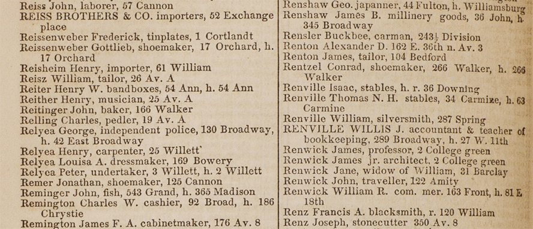

# hocr-detect-columns

Detects columns and connects indented lines in [hOCR files](https://en.wikipedia.org/wiki/HOCR). This Node.js module is used in the NYPL's [NYC Space/Time Directory](http://spacetime.nypl.org/) project to extract data from [digitized New York City directories](https://digitalcollections.nypl.org/search/index?utf8=%E2%9C%93&keywords=city+directory).



Most OCR tools can produce hOCR files — we are using [Tesseract](https://github.com/tesseract-ocr/tesseract).

## But how does it work?

First, hocr-detect-columns uses [Cheerio](https://github.com/cheeriojs/cheerio) to read all pages in the hOCR file (an hOCR file is just an HTML file with special properties).

Per page, the X positions of the bounding boxes of all OCR lines are clustered, using [Simple Statistics](https://simplestatistics.org/). A page with `n` columns should have many lines with bounding boxes on or around `n` different X values. If clustering finds `n` clusters containing most of the OCR lines, we can expect the page has `n` columns.

To connect indented lines with the previous line they belong to, hocr-detect-columns uses a spatial index and tries to find, for each line which doesn't belong to a column, the closest line in the upper-left direction. The algorithms we need are implemented by [RBush](https://github.com/mourner/rbush) (spatial index) and [rbush-knn](https://github.com/mourner/rbush-knn) (nearest neighbor search). You can read more about on spatial search algorithms for JavaScript on [Mapbox's blog](https://blog.mapbox.com/a-dive-into-spatial-search-algorithms-ebd0c5e39d2a).

## Installation & Usage

### Standalone

    npm install -g nypl-spacetime/hocr-detect-columns

hocr-detect-columns can produce the following output formats:

- Log to stdout (default):

```
hocr-detect-columns /path/to/file.hocr
```

- Output JSON:

```
hocr-detect-columns --mode json /path/to/file.hocr
```

- Output NDJSON:

```
hocr-detect-columns --mode ndjson /path/to/file.hocr
```

- Output HTML visualization:

```
hocr-detect-columns --mode html /path/to/file.hocr
```

### As a Node.js module

    npm install --save nypl-spacetime/hocr-detect-columns

```js
const fs = require('fs')
const detectColumns = require('hocr-detect-columns')

const hocr = fs.readFileSync('/path/to/file.hocr', 'utf8')

const config = {}

const pages = detectColumns(hocr, config)
```

## Configuration

You can configure hocr-detect-columns by supplying a JSON configuration object or file:

```js
{
  "columnCount": 2, // Amount of expected columns
  "characterWidth": 25, // Width of character, in pixels
  "minLinesPerColumn": 50 // Minimum expected lines, per column
}
```

## Example

In the directory [`example`](example), you can find an [hOCR file](example/example.hocr) of [page 418 of the 1850 city directory](https://digitalcollections.nypl.org/items/a2b222b0-5293-0134-5861-00505686a51c), as well as a [JSON file](example/example.json) and [HTML visualization](http://spacetime.nypl.org/hocr-detect-columns/example/example.html) generated by hocr-detect-columns.

To generate these files yourself, run:

    hocr-detect-columns --mode json example/example.hocr

Or:

    hocr-detect-columns --mode html example/example.hocr

## Data

The format of the resulting JSON `pages` object is as follows:

```js
{
  "config": {
    …
  },
  "pages": [
    {
      "number": 0,
      "properties": {
        …
      },
      "lines": [
        {
          "properties": {
            "bbox": [
              …
            ],
            …
          }
          "text": "contents of line"
          "columnIndex": 0,
          "completeText": "contents of line, appended with text from indented next lines"
        },
        …
      ]
    },
    {
      "number": 1,
      "properties": {
        …
      },
      "lines": [
        …
      ]
    },
    …
  ]
}
```
